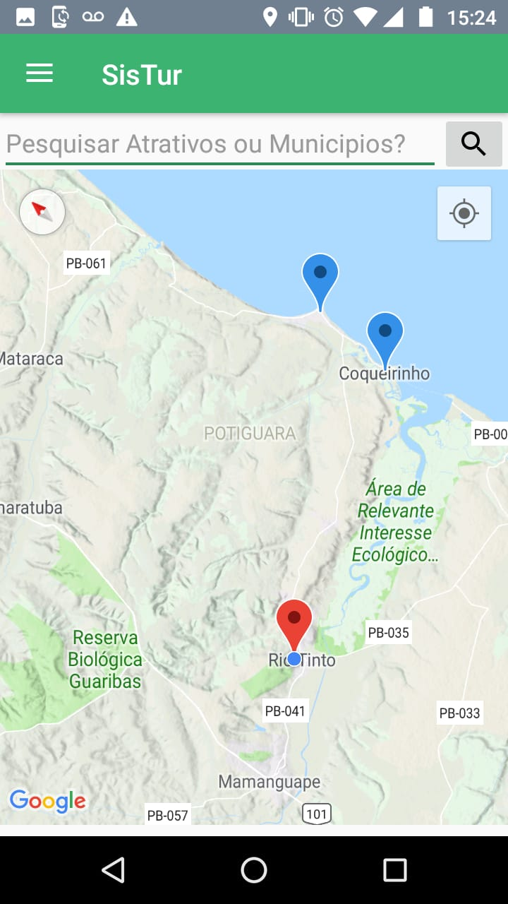
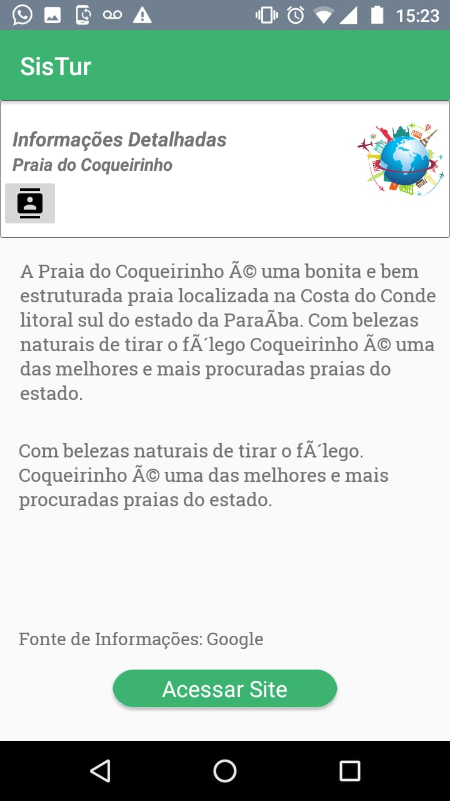

# SisTurApp
# Aplicativo do projeto apps4Society.
# Objetivo, informar aos usuários pontos turisticos e municipios da região, como também da suporte para que o usuário insira seus pontos no applicativo;
# As informações do app são consumidas diretamente de um microservice spring, e armazenadas no dispostivo;

<h4> Imagens App </h4>

 

